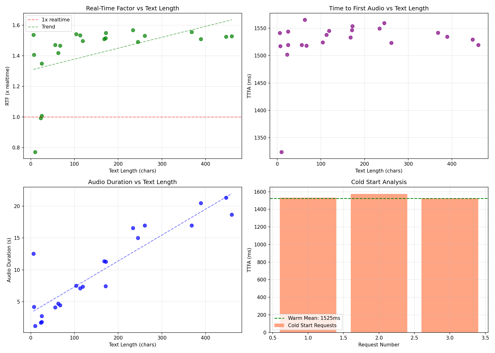

# Orpheus Hindi TTS: Technical Spec

## Stack
- **Inference**: TensorRT-LLM on Modal A100-80GB
- **Fallback**: vLLM (sync mode only - async engine unstable in v0.13)
- **Audio Codec**: SNAC 24kHz
- **Deployment**: Modal with warm containers (`@modal.cls` + `@modal.enter()`)

---

## The Problem: SNAC Backward-Looking Context

SNAC decoder uses **backward-looking context** - early audio samples change when more frames are added later:

```
decode(10_frames)[:N] ≠ decode(all_frames)[:N]
```

This breaks naive streaming approaches:
- **Chunked decode**: Clicks/pops at boundaries
- **Crossfade overlap**: Still audible artifacts
- **Root cause**: Prefix samples are unstable until future context exists

---

## The Breakthrough: LookaheadStreamingDecoder

**Solution**: Only emit samples that have enough "future" context to be stable.

### Algorithm
1. Buffer ALL audio tokens received
2. When N new complete frames arrive:
   - Decode ALL frames from frame 0 (context-preserving)
   - Only emit samples with >= 5 frames of future context
   - Track `samples_emitted` to avoid re-emission
3. On EOS: emit all remaining samples (now stable)

### Lookahead Sweep Results
| Lookahead | MSE | Correlation | Notes |
|-----------|-----|-------------|-------|
| 0 frames | 3.66e-04 | 0.977 | Artifacts |
| **5 frames** | **1.62e-05** | **0.999** | Sweet spot |
| 10 frames | 1.58e-05 | 0.999 | Diminishing returns |

**Trade-off**: ~430ms additional latency for 99.9% quality match with batch decode.

---

## Performance Metrics (A100-80GB)

| Metric | TensorRT-LLM | vLLM |
|--------|--------------|------|
| Tokens/sec | 129-160 | 50-100 |
| TTFA (warm) | **1.5s** | 4-30s |
| RTF (streaming) | **1.4-1.5x** | 0.6-0.8x |
| Cold start | 45-82s | 120-150s |
| Quality | 0.998+ corr | Same |

### Benchmark Summary (22-prompt sweep)
- Mean TTFA: **1525ms**
- Mean RTF: **1.42x realtime**
- Mean chunk gap: **254ms**
- Max chunk gap: **714ms** (worst case)
- Cold vs warm ratio: **1.005x** (negligible difference after warmup)

---

## Why vLLM Failed

vLLM v0.13 introduced V1 architecture with `AsyncLLMEngine`:
- Engine core process dies unexpectedly mid-generation
- No graceful recovery - connections hang
- Async streaming unreliable for production

**Workaround**: Sync generation with `ThreadPoolExecutor` works but limits throughput.

We are working on some workaround for this, exact cause is likely the dying processes, mid-generation.
---

## Current Architecture

```
WebSocket Client
       │
       ▼
Modal Container (warm, pre-loaded)
       │
       ├── TensorRT-LLM Engine
       │       └── Streaming token generation
       │
       └── LookaheadStreamingDecoder
               └── SNAC decode with 5-frame lookahead
                       │
                       ▼
               Binary PCM chunks (int16 @ 24kHz)
```

### Warm Container Strategy
```python
@app.cls(gpu="A100", scaledown_window=300)
class TTSEngine:
    @modal.enter()
    def load_models(self):
        self.llm = load_trt_llm()   # Load once
        self.snac = load_snac()
```

Result: **20x latency reduction** (52s → 2.5s)

---

## Token Constants
```python
SOS_TOKEN = 128257   # Start of Speech
EOS_TOKEN = 128258   # End of Speech
TOKEN_BASE = 128266  # Audio token offset
FRAME_SIZE = 7       # Tokens per SNAC frame
```

---

## Ablataions for prompt sweep



---

## Experiments

### Completed Ablations
- **Lookahead sweep**: Tested 0, 2, 5, 10, 20 frames → 5 is optimal
- **Crossfade streaming**: Failed due to SNAC context dependency
- **Chunked decode**: Artifacts at boundaries, abandoned
- **vLLM async vs sync**: Sync stable, async engine crashes (v0.13)
- **22-prompt length sweep**: TTFA/RTF scales linearly with text length

### Future Work
- Minimum viable lookahead (2-3 frames) for lower latency
- Concurrent scaling (~100 users with queue management)
- Edge cases: silence handling, voice transitions, very short text

## Limits
- Concurrent: ~5 users | Text: 2000 chars | Audio: 120s max

----


# Extending IRA to Multi-modal and Post-training with RL

**References**:
- [Long-Cat Video Technical Report](https://arxiv.org/pdf/2510.22200) - Video generation architecture
- [OLMo-3 Multimodal Report](https://allenai.org/blog/olmo3) - Open multimodal training
- [HuggingFace LM Training Playbook](https://huggingface.co/spaces/HuggingFaceTB/smol-training-playbook) - Training recipes
- [DeepSeek V3 Technical Report](https://arxiv.org/pdf/2412.19437) - MoE + FP8 infra
- [Long-Cat Flash Omni Report](https://arxiv.org/pdf/2511.00279) - Unified omni-modal

---

## Base Models

| Model | Parameters | Modalities | Notes |
|-------|------------|------------|-------|
| Gemma 2 MM | 9B/27B | Text + Vision | Open weights, strong base |
| Qwen2-VL | 7B/72B | Text + Vision + Video | Native dynamic resolution |
| DeepSeek-VL2 | 3B/27B MoE | Text + Vision | MoE efficiency |

---

## RL Post-training Pipeline

### Stage 1: Supervised Fine-tuning (SFT)
- Instruction-following on multimodal data
- Cross-modal alignment (text ↔ audio ↔ vision)
- Hindi-specific data augmentation

### Stage 2: Reward Model Training
- **Preference data**: Human rankings on generation quality
- **Reward signals**: Fluency, coherence, factuality, safety
- Multi-objective reward composition

### Stage 3: RL Optimization

| Algorithm | Pros | Cons | Use Case |
|-----------|------|------|----------|
| **PPO** | Stable, well-understood | High memory (4 models) | Baseline |
| **GRPO** | Memory efficient (no critic) | Higher variance | Resource-constrained |
| **DPO** | Simple, no RL loop | Limited exploration | Quick iteration |
| **RLOO** | Low variance, efficient | Requires multiple samples | Production |

**Current choice**: GRPO for initial runs (lower memory footprint on A100s)

---

## Infrastructure

### Compute Setup
- **Training**: 8× A100-80GB (Modal/RunPod)
- **Framework**: PyTorch + DeepSpeed ZeRO-3
- **Precision**: BF16 training, FP8 inference (where supported)

### Key Optimizations (from DeepSeek V3)
- **MoE sparse activation**: Only 37B active params in 671B model
- **FP8 mixed precision**: 2x throughput on Hopper GPUs
- **Multi-token prediction**: Auxiliary loss for better representations

---

## Experiments Planned

1. **Baseline**: SFT-only on multimodal Hindi data
2. **GRPO vs DPO**: Compare sample efficiency and final quality
3. **Reward ablation**: Single vs multi-objective rewards
4. **Scaling**: 7B → 27B model size impact on RL stability

